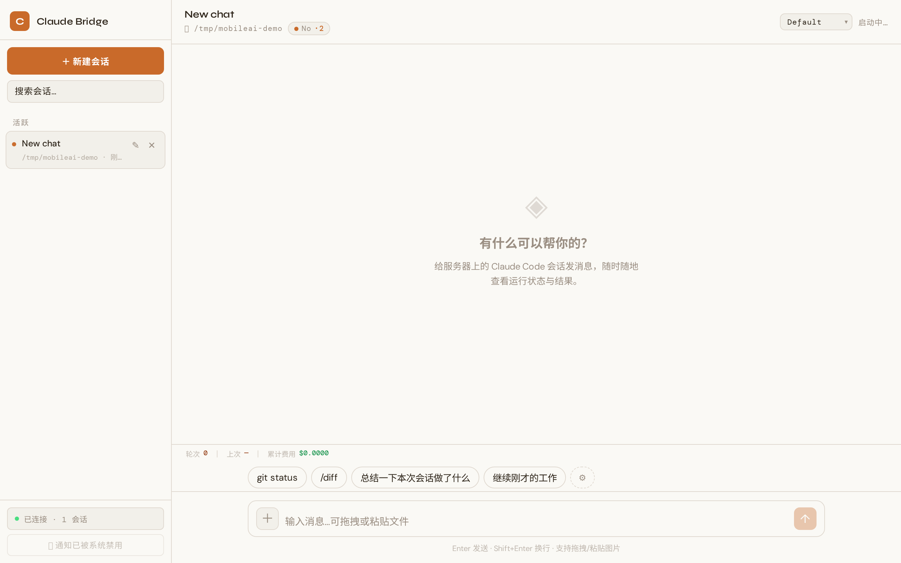
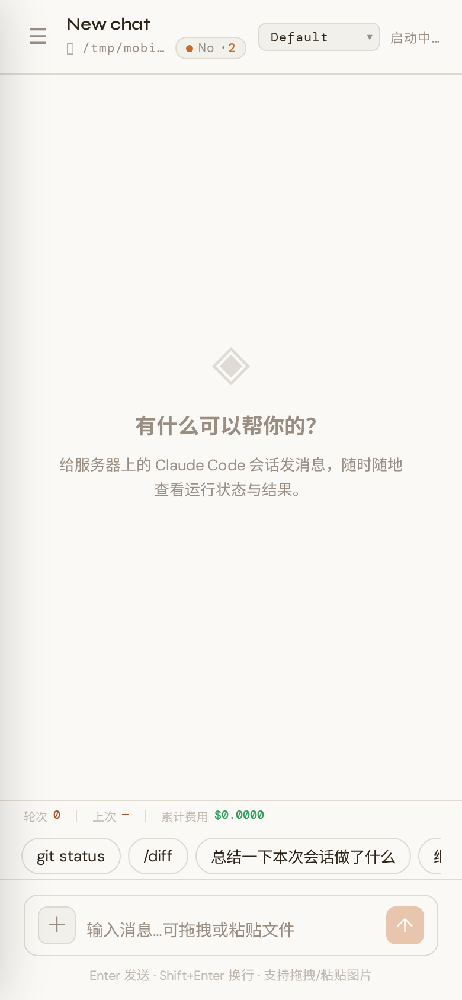
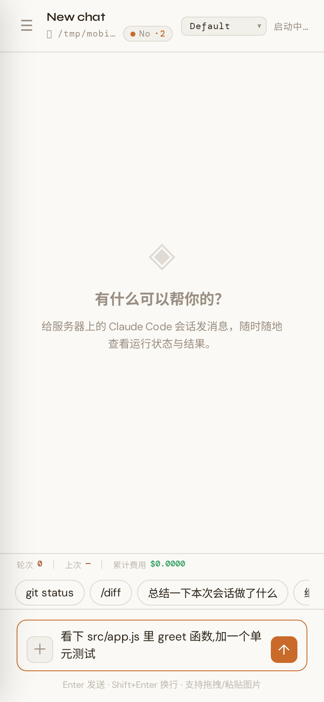
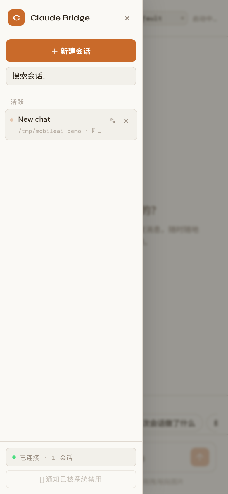
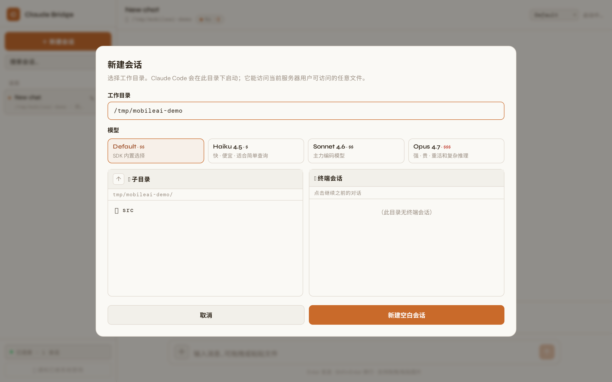

# mobileai

**Use Claude Code from your phone.** A self-hosted bridge that puts a
long-running [Claude Code](https://docs.claude.com/en/docs/claude-code/overview)
session behind a polished chat UI you can reach from any device.

<p align="center">
  <a href="https://github.com/Crazycreate/claude-bridge/releases/latest/download/app-debug.apk">
    
  </a>
</p>

> 🇨🇳 [中文 README](#zh) at the bottom.

<p align="center">
  
</p>

<p align="center">
  
  
  
</p>

<p align="center">
  
</p>

> **Honest disclaimer up front.** Anthropic ships a first-party feature called
> [`/remote-control`](https://code.claude.com/docs/en/remote-control) that
> covers the most common case: connect claude.ai/code or the Claude mobile app
> to a `claude` process running on your machine. **If you just want "use Claude
> Code from my phone," try `claude --remote-control` first — 30 seconds, no
> setup.** This project exists for the cases where that isn't enough; see
> [vs official Remote Control](#vs-official-remote-control) below.

---

## Features

- 📱 **Phone-first chat UI** — multi-session sidebar, session search, quick-action chips, attachments, code highlighting
- 🪞 **Persistent server-side sessions** — survive client disconnects and bridge restarts (`resume` keeps Claude's context intact)
- 📂 **In-browser working-directory picker** — no SSH needed to remember what's on the server
- 🗂 **Browse, reopen, delete past conversations** — an "Open" dialog lists every session under any directory: this app's own _and_ Claude CLI terminal sessions from `~/.claude/projects`; reopen, hide, or delete each
- 🔐 **Permission approvals as cards** — Claude asks before running anything sensitive
- 📎 **Drag/paste/upload files** — images, PDFs, logs; Claude reads them via its `Read` tool
- 💰 **Live cost tracking** — per-turn duration and accumulated USD spend
- 🌿 **Per-session git status** — branch + dirty count right in the topbar
- 🚦 **Mid-conversation model switching** — Haiku for cheap queries, Opus for heavy lifts
- 🔔 **Web Push notifications** — Claude finishes a long turn or needs permission → your phone buzzes
- 📲 **Installable Android app** — a Capacitor APK built in CI, no local Android SDK needed; or just use the PWA's "Add to Home Screen"

## vs official Remote Control

[`/remote-control`](https://code.claude.com/docs/en/remote-control) is built
into Claude Code 2.1.51+. It runs Claude locally and routes
input/output through Anthropic's servers. It's polished, free (with any
claude.ai plan), and needs zero setup. Use it unless you need something it
doesn't offer.

| | `/remote-control` | **mobileai** |
|---|---|---|
| Setup | one CLI flag, 30 s | clone + build, 5 min |
| Tunneling / NAT | **none needed** — outbound HTTPS to api.anthropic.com | needs Tailscale / Cloudflare Tunnel / public IP |
| Auth | claude.ai OAuth subscription required (Pro / Max / Team / Enterprise) | **anything** — works with API key, subscription, or both |
| Data path | through Anthropic's servers (TLS, but a middle hop) | **end-to-end self-hosted** — nothing routed externally |
| Browse `~/.claude/projects/` history from phone | ❌ | ✅ |
| Switch cwd from the phone | ❌ (locked to launch dir) | ✅ |
| Topbar shows cwd, git branch, dirty count | ❌ | ✅ |
| Drag-drop file uploads on phone | ❌ | ✅ |
| Self-defined UI / customizable | ❌ | ✅ open source |
| Push notifications | ✅ first-party | ✅ Web Push, opt-in per device |
| Multi-user / shared deploy | ❌ | partial (single shared token) |
| Source-available transcripts | through claude.ai | **on disk in plain JSON** |

**Pick mobileai if any of these matter to you:**

- You use Claude Code with an **API key** rather than a claude.ai subscription
- You want **conversation transcripts to stay on your hardware** (compliance, privacy, air-gapped builds)
- You want to **browse and resume any old conversation across any project directory** from the phone
- You want to **fork the UI** for your own workflow (custom slash commands, integrations, themes)
- You're building this as a portfolio / learning project

## Pick your path

There are two realistic situations. Read the heading and skip to the right one:

| If your server is… | Use |
|---|---|
| Reachable directly — VPS, home server, your laptop, anything with a routable IP or on the same LAN as your phone | [**Path A — Direct**](#path-a--direct-vps--home-server--lan) |
| Behind a corporate / school NAT or firewall, and you want to reach it from outside | [**Path B — Overlay network**](#path-b--corporate-or-school-network) |

The setup steps are identical until the very end (how to reach it from your phone). Both paths offer either a **Docker** route (truly zero-dependency) or a **Native** route (Node + scripts).

---

## Path A — Direct (VPS / home server / LAN)

### Option 1: Docker (recommended, 3 commands)

```bash
git clone https://github.com/YOUR_USERNAME/mobileai.git
cd mobileai

cp .env.example .env
# Edit .env — at minimum:
#   AUTH_TOKEN=$(openssl rand -hex 24)
#   ANTHROPIC_API_KEY=sk-ant-...    # OR mount your ~/.claude (see .env.example)
#   PROJECT_DIR_HOST=/path/to/your/project    # what Claude works on

docker compose up -d
```

Then open `http://<your-server-ip>:8787` on your phone, paste the AUTH_TOKEN, you're in.

The `./data` directory holds your chat history — back it up if you care.

### Option 2: Native (no Docker)

```bash
git clone https://github.com/YOUR_USERNAME/mobileai.git
cd mobileai

./setup.sh           # installs deps, generates AUTH_TOKEN, builds frontend
./scripts/bridge start
```

Setup prints the token at the end. Open `http://<your-server-ip>:8787`, paste it.

To make it survive logout / reboot:
- **Linux with systemd-user** (no sudo needed): `loginctl enable-linger` once,
  then symlink `scripts/bridge` into `~/.local/bin/`. Bridge will keep running
  after you log out of SSH.
- **macOS**: use `launchd`, or just run inside `tmux`.

### Optional: HTTPS

8787 is plain HTTP. For phones on the public internet you'll want TLS. Easiest is a Caddy / nginx reverse proxy in front, or skip ahead to [Path B](#path-b--corporate-or-school-network)'s Tailscale option which gives you HTTPS for free.

---

## Path B — Corporate or school network

The server can't be reached directly. Solution: put both your phone and the server on the **same overlay network**.

> ⚠️ **Read this before continuing.** Running an overlay/tunneling client on a
> corporate-managed machine is usually against IT policy and trivially detected
> by modern EDR. Use this on machines you fully own, or on personal hardware
> the company doesn't manage. Otherwise ask IT for their sanctioned mobile-VPN
> path — most enterprises have one.

### Step 1: Set up the bridge

Follow Path A above (Docker or native) so the bridge is running locally on
`8787`. Stop before exposing it.

### Step 2: Pick an overlay

#### Option B1: Tailscale (simplest, P2P, free for individuals)

```bash
# On the server
curl -fsSL https://tailscale.com/install.sh | sh
sudo tailscale up                 # follow the URL, log in
sudo tailscale serve --bg 8787    # exposes the bridge as HTTPS to your tailnet
tailscale status                  # shows your tailnet hostname
```

- Install the **Tailscale** app on your phone, log in with the **same account**.
- Open `https://<hostname>.<tailnet>.ts.net/` from the phone.
- Auto-issued Let's Encrypt cert, no public exposure, only your devices can reach it.

**No sudo on the server?** Tailscale has a userspace mode; see [their docs](https://tailscale.com/kb/1112/userspace-networking). The included `scripts/bridge` is decoupled from any specific network setup, so use whatever overlay you prefer.

#### Option B2: Cloudflare Tunnel (real public hostname)

```bash
# Install cloudflared, then
cloudflared tunnel login
cloudflared tunnel create mobileai
cloudflared tunnel route dns mobileai claude.yourdomain.com
cloudflared tunnel run --url http://localhost:8787 mobileai
```

Pair with **Cloudflare Access** to gate the URL behind OAuth. Result: anyone in the world reaches `https://claude.yourdomain.com`, but only logged-in you gets past Access.

#### Option B3: Your own reverse tunnel

`frp`, `bore`, `localtunnel`, anything that fits your stack. The bridge doesn't care — it just listens on `:8787`.

---

## Configuration reference

All settings live in `.env` (Docker) or `server/.env` (native).

| Variable | Default | Notes |
|---|---|---|
| `AUTH_TOKEN` | _(required)_ | Shared secret clients send to log in. ≥16 chars. |
| `PORT` | `8787` | Bridge listening port. |
| `PROJECT_DIR` | _(required)_ | Default working directory for new sessions. `/work` in Docker. |
| `PROJECT_DIR_HOST` | `./workspace` | Docker only — host directory mounted at `/work`. |
| `PERMISSION_MODE` | `default` | `default` / `acceptEdits` / `bypassPermissions` / `plan`. |
| `ANTHROPIC_API_KEY` | _(unset)_ | If set, bypasses the logged-in `claude` CLI account. |

## Day-to-day

```bash
./scripts/bridge start      # start (background)
./scripts/bridge stop       # stop
./scripts/bridge restart    # after editing server-side code
./scripts/bridge status     # is it running? on which port?
./scripts/bridge logs       # tail -F the bridge log
./scripts/bridge token      # print AUTH_TOKEN
```

Docker users:

```bash
docker compose up -d        # start
docker compose down         # stop
docker compose logs -f      # tail logs
docker compose restart      # after image rebuild
```

## Android app (APK)

The web app is a PWA — "Add to Home Screen" already gives an app-like
experience. For a real installable APK, the project ships a Capacitor Android
wrapper.

**Just want the app?** Grab the latest prebuilt APK from
[**Releases**](https://github.com/Crazycreate/claude-bridge/releases/latest) —
direct link: **[app-debug.apk](https://github.com/Crazycreate/claude-bridge/releases/latest/download/app-debug.apk)**.
Copy it to your phone and install it (allow "install from unknown sources").

**First launch** asks for the **server address** and **AUTH_TOKEN** — enter the
bridge URL your phone can reach (e.g. `http://192.168.1.5:8787` on a LAN, or a
tunnel URL). Both are stored only on the device.

> The app allows cleartext HTTP so it can reach a plain-HTTP bridge. For
> exposure beyond a trusted LAN, put the bridge behind HTTPS or a tunnel and
> enter the `https://` URL instead.

**Build it yourself** — no local Android SDK needed, GitHub does the build:
the **Actions** tab → **Build Android APK** → **Run workflow** (or push a `v*`
tag). When the run goes green, download the **claude-bridge-debug-apk** artifact
(a `.zip`) and unzip `app-debug.apk` from it.

Or fully local, which needs JDK 17 + Android SDK:

```bash
npm run build:web
cd frontend && npx cap sync android && cd android
./gradlew assembleDebug   # → app/build/outputs/apk/debug/app-debug.apk
```

## Repo layout

```
mobileai/
├── shared/      # Wire protocol types shared by server and frontend
├── server/      # Express + WebSocket + Claude Agent SDK
├── frontend/    # React + Vite PWA  (+ android/ — Capacitor APK wrapper)
├── scripts/     # bridge — start/stop/status helper
├── .github/     # CI — Build Android APK workflow
├── setup.sh     # one-shot installer
├── Dockerfile
├── docker-compose.yml
└── .env.example
```

## Stack

- Server: Node 18+, Express, `ws`, `@anthropic-ai/claude-agent-sdk`, multer
- Frontend: React 18, Vite, vite-plugin-pwa, marked + highlight.js + DOMPurify
- Android: Capacitor 6 wrapper, debug APK built via GitHub Actions
- Build: TypeScript everywhere, npm workspaces

## Acknowledgements

- The UI takes visual cues from [Claude.ai](https://claude.ai)'s warm-paper aesthetic and from [chriswritescode-dev/opencode-manager](https://github.com/chriswritescode-dev/opencode-manager), which solves the same problem for OpenCode.
- Powered by [Claude Code](https://docs.claude.com/en/docs/claude-code/overview) and the [Claude Agent SDK](https://docs.claude.com/en/docs/agent-sdk/).

## License

MIT — see [LICENSE](LICENSE).

---

<a id="zh"></a>
## 中文说明

在手机上用网页操作服务器上的 Claude Code,任何网络环境都能用。

> **先看这个**:Claude Code 2.1.51+ 已经内置 [`/remote-control`](https://code.claude.com/docs/en/remote-control) 官方功能,本地跑 `claude --remote-control` 一条命令,手机用官方 Claude app 就能接管。**如果你只是想"手机用 Claude Code"**,先试官方的,30 秒搞定,不用任何穿透。
>
> 这个项目存在的意义在于官方功能解决不了的几个场景。下面"vs Claude 官方 Remote Control"详细对比。

**核心能力**:多会话侧边栏、工作目录选择器、**「打开历史对话」**(按目录浏览本应用会话 + Claude CLI 终端历史,一键打开 / 隐藏 / 删除,跨任意 cwd)、工具调用卡片、权限批准、文件/图片上传、Markdown + 代码高亮、git 状态、模型切换(Haiku/Sonnet/Opus)、会话搜索、快捷指令、Web Push 推送通知、PWA 加主屏。

### vs Claude 官方 Remote Control

| 维度 | `/remote-control`(官方) | **mobileai**(自托管) |
|---|---|---|
| 上手成本 | 30 秒 | 5 分钟 |
| 内网穿透 | **不需要**(走 Anthropic 出站 HTTPS) | 需要 Tailscale / Cloudflare Tunnel / 公网 IP |
| 鉴权 | 必须 claude.ai 订阅(Pro / Max / Team / Enterprise) | API key / 订阅 / 都支持 |
| 数据路径 | 经 Anthropic 服务器中转 | **完全自托管**,数据不出本地网络 |
| 手机浏览 `~/.claude/projects/` 历史 | ❌ | ✅ |
| 手机端切 cwd | ❌(启动时锁定) | ✅ |
| 顶栏 cwd / git / dirty | ❌ | ✅ |
| 拖拽附件上传 | ❌ | ✅ |
| 推送通知 | ✅ 官方 | ✅ 自托管 Web Push |
| UI 可定制 | ❌ | ✅ 开源 |

**适合用 mobileai 的场景**:用 API key 不用 claude.ai 订阅;数据不能出本地网络(合规/隐私);经常要在手机上翻几个月前的历史会话;想 fork UI 加自己功能。

### 两条路径(看你的服务器位置)

**路径 A — 服务器手机能直连(VPS / 家用机 / 同 LAN):**

最简(Docker):
```bash
git clone https://github.com/YOUR_USERNAME/mobileai.git && cd mobileai
cp .env.example .env  # 编辑 AUTH_TOKEN 和 ANTHROPIC_API_KEY
docker compose up -d
# 手机打开 http://<服务器IP>:8787
```

或者非 Docker:
```bash
./setup.sh                  # 一键安装 + 生成 token + 构建前端
./scripts/bridge start
```

**路径 B — 服务器在公司/学校内网:**

先按路径 A 把 bridge 跑起来,然后用覆盖网络:
- **Tailscale**(最简,P2P,无需开端口): `sudo tailscale up && sudo tailscale serve --bg 8787`,手机装 Tailscale app 即可
- **Cloudflare Tunnel**(真实公网域名 + OAuth):见 README 英文部分

⚠️ **重要**:在受公司管控的机器上跑任何 VPN/隧道客户端,通常都违反 IT 政策,而且很容易被 EDR 检测到。只在你自己的机器上用,或者跟 IT 申请他们的合规方案。

### 日常命令

```bash
./scripts/bridge start|stop|restart|status|logs|token
docker compose up -d | down | restart | logs -f
```

### 配置项

详见 [`.env.example`](.env.example)。最少要设 `AUTH_TOKEN`(必填)和 Claude 认证(`ANTHROPIC_API_KEY` 或 mount `~/.claude`)。

### 安卓 App(APK)

网页版本身是 PWA,「添加到主屏幕」即可当 App 用。要装真正的 APK:

**直接下载** —— 从 [**Releases**](https://github.com/Crazycreate/claude-bridge/releases/latest)
拿最新预编译包,直链:**[app-debug.apk](https://github.com/Crazycreate/claude-bridge/releases/latest/download/app-debug.apk)**,
传到手机安装(需允许「未知来源」)。

首次启动会让你填**服务器地址**和 **AUTH_TOKEN** —— 填手机能访问到的 bridge 地址
(局域网如 `http://192.168.1.5:8787`,或隧道地址),两者只存在本机。超出可信局域网
范围时,建议给 bridge 套 HTTPS 或隧道,再填 `https://` 地址。

**自己构建** —— 仓库 **Actions** 页 → **Build Android APK** → **Run workflow**
(或推 `v*` tag),跑完从 artifacts 下载 `claude-bridge-debug-apk`(zip,解压出 `.apk`)。
